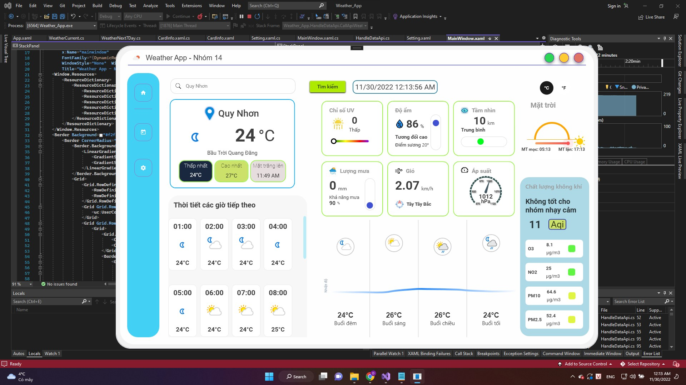
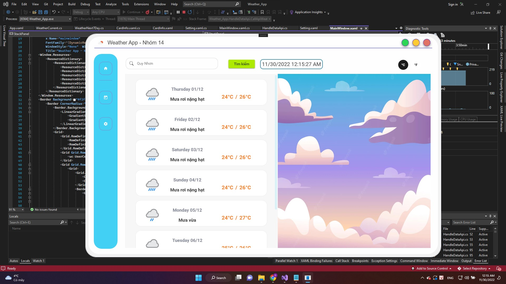
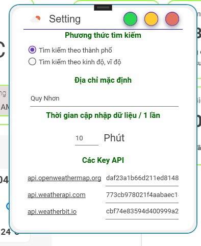

# Weather App

## Overview

Weather App is a desktop application that allows users to view weather information from various data sources such as OpenWeatherMap, Weatherbit.io, and WeatherAPI.com. The application is developed using WPF technology and utilizes Material Design In XAML to provide a modern and user-friendly interface.




## Features

- **Current weather information:** Display data on current temperature, humidity, wind speed, and weather conditions.
- **Weather forecast:** Allow users to view weather forecasts for the week.

## Requirements

- .NET Framework 5 or higher

## Installation

1. Clone the repository from GitHub:

```
git clone git@github.com:dient16/weather-app-wpf.git
```

2. Open the solution in Visual Studio.
3. Build the solution to install dependencies from NuGet.

## Configuration

1. Register and obtain API keys from the following services:

- OpenWeatherMap: [Sign Up](https://openweathermap.org/)
- Weatherbit.io: [Sign Up](https://www.weatherbit.io/)
- WeatherAPI.com: [Sign Up](https://www.weatherapi.com/)

2. Run the application and set the API key in the settings section:

   

## Credits

- Material Design In XAML: [GitHub Repository](https://github.com/MaterialDesignInXAML/MaterialDesignInXamlToolkit)
- OpenWeatherMap API: [Website](https://openweathermap.org/)
- Weatherbit.io API: [Website](https://www.weatherbit.io/)
- WeatherAPI.com API: [Website](https://www.weatherapi.com/)
